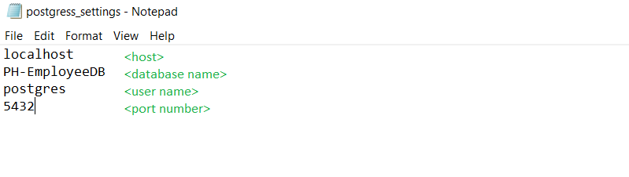

# <CSV_TO_DB-PyScript>

	This program creates PH-Employee tables and attempts to import the
	the csv file data into the tables.

	* Require steps
		step 1) Have a 'postgress_settings.txt' file in your parent directory of the
				executable program.
				
				It must have 4 lines that specifies the setting in order:
				host:			server host the connector will link to.
				database name:	the database name the connector will link to.
				user name:		the user name for the server.
				port:			the port number the connector will link to.
				
				Modify it if needed. [The Default values should work]
		step 2) The Executable program (parent directory) MUST have a 'csv' folder/directory.
				In there should be all (6) required CSV files for this Database.
				Must be the six files or the program could crash.
				
			  
Submitted by: <Raul Rivero Rubio>

## User Stories

The following **required** functionality to proceed is complete:

* [X] Creates the necessary database tables
* [X] Drops the necessary database tables
* [X] Reads the necessary data from the CSV files.
* [X] Inserts the necessary data to to database tables.
* [X] Closes and exits successful.

The following **additional** features are implemented:
* [X] Imports and checks for required packages and modules
* [X] Downloads and install the required packages and modules
* [ ] Linux or Mac testing.

## Video Walkthrough

Here's a walkthrough of implemented user stories:

## Notes

Describe any challenges encountered while building the app.
automate clickable calenders.
porting executable to different OS.

## License

Copyright 2019 <Raul Rivero Rubio>

Licensed under the Apache License, Version 2.0 (the "License");
you may not use this file except in compliance with the License.
You may obtain a copy of the License at

http://www.apache.org/licenses/LICENSE-2.0

Unless required by applicable law or agreed to in writing, software
distributed under the License is distributed on an "AS IS" BASIS,
WITHOUT WARRANTIES OR CONDITIONS OF ANY KIND, either express or implied.
See the License for the specific language governing permissions and
limitations under the License.