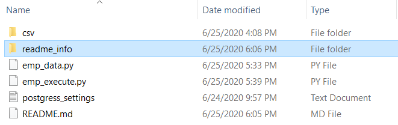

# <CSV_TO_DB-PyScript>
```diff
	This program creates PH-Employee tables and attempts to import the
	the csv file data into the tables.
	
	hint: program performs quicker in the os shell than the 'Python IDLE shell'
		Expect long [run time] of approximately 30 minutes or more.

+ 				REQUIRED
		Step 1) Have the [Postgres] DB Server running.
		Step 2) Make sure that the [PH-EmployeeDB] have been created. It must exists and must be named correctly.
				This DB name is include in 'postgress_settings.txt' for the program.
		step 3) Have a 'postgress_settings.txt' file in your parent directory of the
				executable program.
				
				It must have 4 lines that specifies the setting in this specific order:
				host:			server host the connector will link to.
				database name:	the database name the connector will link to.
				user name:		the user name for the server.
				port:			the port number the connector will link to.
				
				Modify it if needed. [The Default values should work]
		step 4) The Executable program (parent directory) MUST have a 'csv' folder/directory.
				In there should be all (6) required CSV files for this Database.
				Must be the six files or the program could crash.
				*
				Any missing value in a NOT NULL table column could crash the program.
				Any incorrectly formated date could crash the program.
				Any numeric value beyond table column capacity could also crash the program.
			
! 				WARNING: 
				Do Not run any sql command in the DB while the program is still executing.
				Do Not open the csv files while the program is executing.
```			  
Submitted by: # Raul Rivero Rubio

Postgress Driver [Default] Settings.
```diff
+ green words
```
are not included on the file.


Parent Directory of the Executable program.


## User Stories

The following **required** functionality to proceed is complete:

* [X] Creates the necessary database tables
* [X] Drops the necessary database tables
* [X] Reads the necessary data from the CSV files.
* [X] Insert the necessary data to the database tables.
* [X] Closes and exits successfully.
* [x] Fully tested and accomplishes the overall tasks.

The following **additional** features are implemented:
* [X] Imports and checks for required packages and modules
* [X] Downloads and install the required packages and modules
* [ ] Linux or Mac testing.

## Video Walkthrough

Here's a walkthrough of implemented user stories:
NOTE: this a simple example of the overall function of the application.
		It tested with the smallest csv possible due to the video's time constraint.
		However, this concept applies to any of the tables. All csv and tables having been fully tested.
		


## License

Copyright 2019 <Raul Rivero Rubio>

Licensed under the Apache License, Version 2.0 (the "License");
you may not use this file except in compliance with the License.
You may obtain a copy of the License at

http://www.apache.org/licenses/LICENSE-2.0

Unless required by applicable law or agreed to in writing, software
distributed under the License is distributed on an "AS IS" BASIS,
WITHOUT WARRANTIES OR CONDITIONS OF ANY KIND, either express or implied.
See the License for the specific language governing permissions and
limitations under the License.
